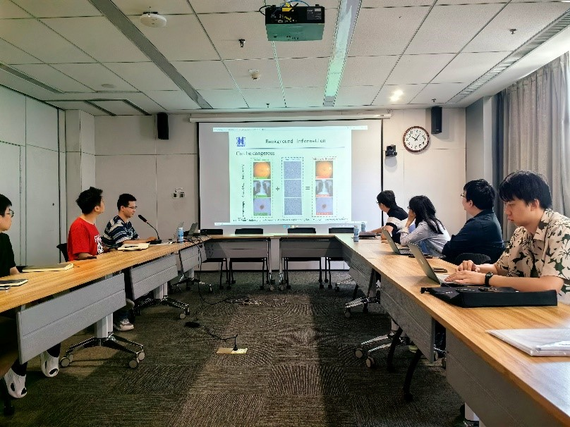
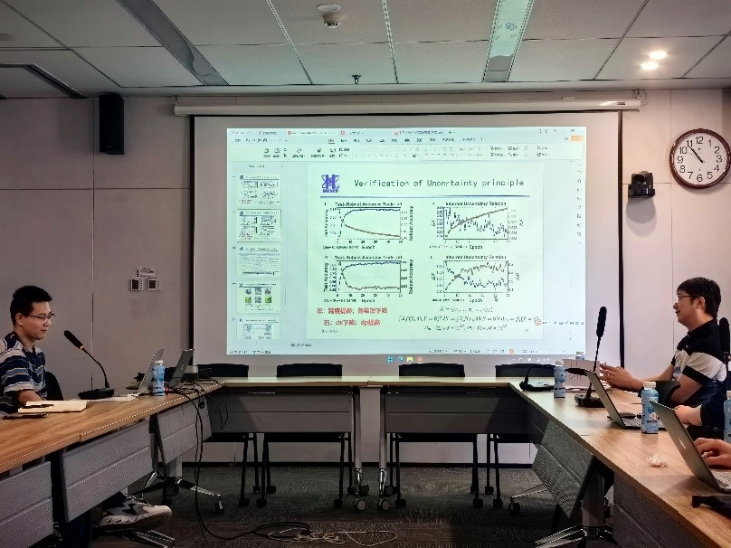

2024年5月15日 西北核技术研究所副研究员张俊杰访问我室开展学术交流

<!--more-->

---

5月15日，西北核技术研究所副研究员张俊杰应邀来我室进行学术访问，为与会师生做了一场题为《量子启发的神经网络脆弱性研究—对偶量在系统攻击中扮演的角色》的学术报告。

</img>

讲座中，张俊杰副研究员主要分享了神经网络的安全性的研究成果。首先对神经网络安全的基本概念和应用场景以及研究必要性进行了简要介绍。人工智能在计算机视觉、策略规划等多个领域的广泛应用中，攻击者可以利用神经网络损失函数关于输入的梯度信息，即输入的共轭变量，对网络进行轻微调整，从而在不知不觉中破坏、甚至操控预测结果。这种对输入共轭变量的攻击暴露了网络结构内在的薄弱性。

为揭示这一问题的本质，张俊杰副研究员介绍了一种新颖的研究思路，即应用量子力学中不确定性原理的数学框架分析神经网络的脆弱性，从而阐明了输入共轭变量在系统攻击中的重要作用。并进一步揭示了神经网络在面对微小非随机扰动时表现出的脆弱性，与量子物理中的不确定性原理在数学上的高度一致性。

</img>

随后，张俊杰副研究员提出了基于大模型安全性的开放性问题，为未来理解这些所谓的“黑箱”网络系统提供了新的交叉学科视角。在提问互动环节，张俊杰副研究员与在场师生积极互动，耐心细致地答疑解惑，大家纷纷表示在今天这场交流会中收获颇丰。

------

人物简介：张俊杰博士，现为西北核技术研究所副研究员，物理与智能计算研究室副主任。毕业于火箭军工程大学(中国科学技术大学联合培养)，长期从事智能科学计算与碰撞等离子体模拟相关工作计算。在Natl Sci Rev,Comput. Phys.Commun., Phys.Rev.D., PhysRev.C., Phys.Rev.Res.等期刊发表论文30余篇，承担国家自然科学基金青年基金、某部预研等项目4项。其碰撞等离子体极化效应的工作被领域内多篇综述文章和顶级期刊工作引用近百次，并在领域内最高会议Quark Matter上做报告。所开发的碰撞等离子体计算框架RBG-Maxwe1l引用超五十余次,并受邀在2021年亚太地区等离子体会议作报告关于无碰撞等离子体模拟的工作是国内首份公开的关于高空核爆碎片云等离子体演化的工作，受到了包括法国原子能和替代能源委员会高级顾问Claude Guet教授等专家的高度关注。
