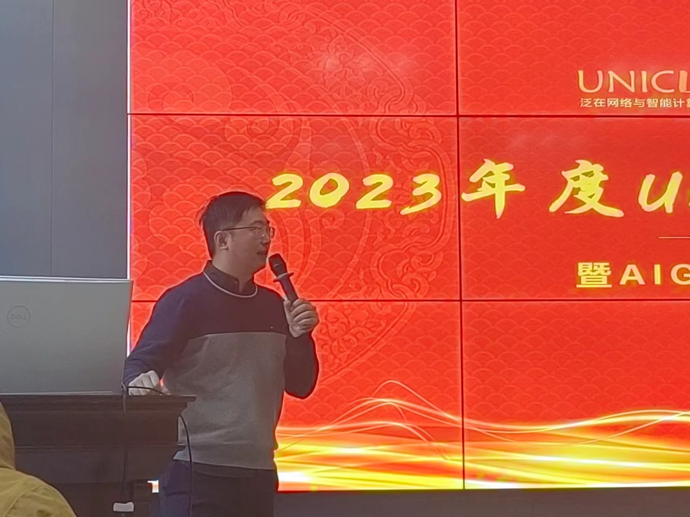

UNIC实验室成功举办2023年年度年会暨AIGC主题分享会

<!--more-->

2024年1月22日，我实验室成功举办了2023年度实验室年会暨AIGC主题分享会。本次分享会由本实验室承楠教授赞助，并由实验室的不同团队介绍各自在AIGC领域调研的研究成果和应用案例。

本次主题分享会由UNIC实验室的博士沈京龙和硕士齐阁担任主持，并以承楠教授的致辞开场。承楠教授表示，近来AIGC技术得到了广泛的关注，并且在大模型面向公众问世后一年中得到了快速的发展，并对实验室的成员提出了将AIGC技术调研与自身科研方向相结合的殷切要求。本次分享会也旨在提供一个内部分享的平台，提升实验室成员对AIGC技术的关注度，并且推动大家对AIGC技术的了解和深入探讨。西安电子科技大学通信工程学院的承楠教授、尹志胜副教授、孙瑞锦副教授，付宇钏副教授，华为无线技术实验室专家张逸炎，西安交通大学通信工程学院的彭海霞教授出席本次年会并担任评委。

</img>

本次讲座汇报分为应用案例分析、伦理与责任、创新与创意、交互与演示、未来展望五大内容板块。共九个由UNIC实验室学生组成的团队进行了AIGC技术的相关内容分享，各团队分别讨论了不同行业中的实际应用案例、消除内容生成偏见、隐私、信息误导等问题、在文本、音乐、艺术内容创作中激发创意、实时演示AIGC交互过程与效果、展望AIGC技术的未来发展方向及可能带来的变革等内容。

    </img>
	</img>

在本次汇报中，各评委对团队展现效果进行了客观公正且具有启发性的评价。各专家对团队汇报内容的展示效果、汇报思路、理解深度、思考全面性等多个维度进行了逐一评价，并各自提出了建议与修改意见，同时提供了下一步深入技术研究、细化具体研究领域及问题的参考方案。各团队在现场激烈的交流中不断完善了对AIGC技术目前面临的关键问题、研究瓶颈的认识，并且对于AIGC技术及相关研究如何寻找研究切入点，提升AIGC现有模型与实现方案并与通信领域结合等问题有了更全面的视角与见解。

	</img>
	</img>

汇报过后，根据评委专家意见及评分汇总，对表现突出的团队分别颁发了奖项。颁奖典礼环节与晚宴进行，各评委专家及UNIC实验室全体学生参加并出席晚宴，对长达一天的AIGC技术汇报进行了内容总结。

	</img>
	</img>  
	</img>
	</img>

华为技术有限公司，西安电子科技大学通信工程学院、西安交通大学通信工程学院等共计30余人参加此次活动。
