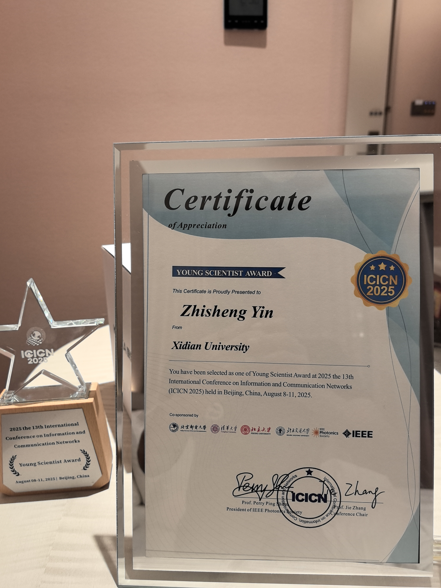

UNIC 实验室尹志胜副教授担任 ICICN 2025 分会主席并获得“青年科学家奖”。

<!--more-->

IEEE ICICN 2025 (2025 IEEE 13th International Conference on Information and Communication Networks) 于 2025 年 8 月 8 日至 11 日在北京圆满举行。本次大会由北京邮电大学、清华大学、北京大学、北京交通大学、IEEE 光子学会及 IEEE 联合主办，北京邮电大学集成电路学院、信息光子学与光通信全国重点实验室承办，并获得南方科技大学、西北工业大学、澳门科技大学、西安理工大学、陕西师范大学、西安电子科技大学、西安交通大学、陕西科技大学、长春理工大学、广西大学、中国联通研究院、中国移动研究院等多所国内外高校及科研机构支持。

本次会议为期 3 天，除主旨报告外，还设置了无线传输与通信、量子信息与纳米光子学、光互连与光传感等多个专题分会场，涵盖若干主题方向及竞赛单元。UNIC 实验室尹志胜副教授受邀作为天地一体化通信网络 (Satellite-terrestrial Integrated Communications and Networks) 分会的主席参加本次会议，并获得最佳青年科学家奖。

</img>
