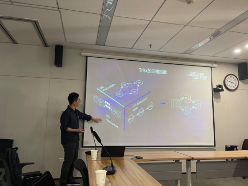
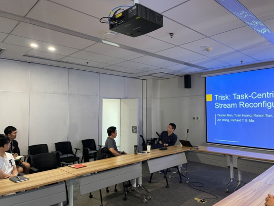

新加坡国立大学计算机学院 Richard T. B. Ma 访问我室开展学术交流

<!--more-->

2023年9月4日，新加坡国立大学计算机学院副教授Richard T. B. Ma应邀来我室进行学术访问，为与会师生做了一场题为 “Task-Centric Data Stream Reconfiguration” 的学术报告。

讲座中，Richard T. B. Ma主要分享了目前以任务为中心的数据流任务重配置技术的研究成果。首先对当前网络设备对接中流作业不能及时有效地处理数据这一问题进行了简要讲解，并指出了从MapReduce到Spark和Flink这些任务处理机制或平台因为其任务容器创建和删除的整体特性，都需要在重配置计算任务时耗费大量重启时间和资源，从而影响了流数据处理效率。为了实现更高的性能要求，需要动态地重新配置流作业，基于此设计了Trisk任务控制平台以支持通用的任务重配置，同时保持高效和易使用的编程接口。

</img>

为了让大家更直观地感受Trisk平台在进行流数据任务重配置过程中的优势，Richard T. B. Ma结合具体的系统模型和数据流示意图展示了Trisk平台在具体任务重配置过程中的事件监听、重配置需求诊断以及新容器的配置参数确定过程，并给出了与传统任务重配置的整体流程对比。其中详细讲解了Trisk平台仿真流程中的实验细节，显示了重配置计算任务后数据处理时延的显著降低以及任务处理的稳定性。

</img>

随后，Richard T. B. Ma总结了自己在网络经济学与流数据任务重配置这一成果进行了总结并展望了未来的发展方向。同时，Richard T. B. Ma也与与会师生交流了与工业界进行项目合作的经历与心得，为研究室与工业界的合作方式与努力方向提出了具有参考价值的建议，与在场师生积极互动，耐心细致地答疑解惑，大家纷纷表示在今天这场交流会中收获颇丰。

**人物简介**

Richard T. B. Ma，分别于2002年7月和2004年7月获得香港中文大学计算机科学学士学位与硕士学位，于2010年5月获得哥伦比亚大学电气工程博士学位。博士学位期间，于美国纽约约克敦海茨IBM Thomas J. Watson研究中心和西班牙巴塞罗那西班牙电信研究中心任研究实习生。2010年至2014年，任职美国伊利诺斯州香槟分校厄巴纳-香槟分校高级数字科学中心（ADSC）研究科学家。目前任新加坡国立大学计算机学院副教授，ACM和IEEE的高级成员。

主要研究方向包括分布式系统与网络经济学。近年荣获ACM Mobihoc 2020年最佳论文奖亚军，IEEE IC2E 2013、IEEE ICNP 2014、IEEE Workshop on Smart Data Pricing 2015最佳论文奖，累计引用3100余次。
