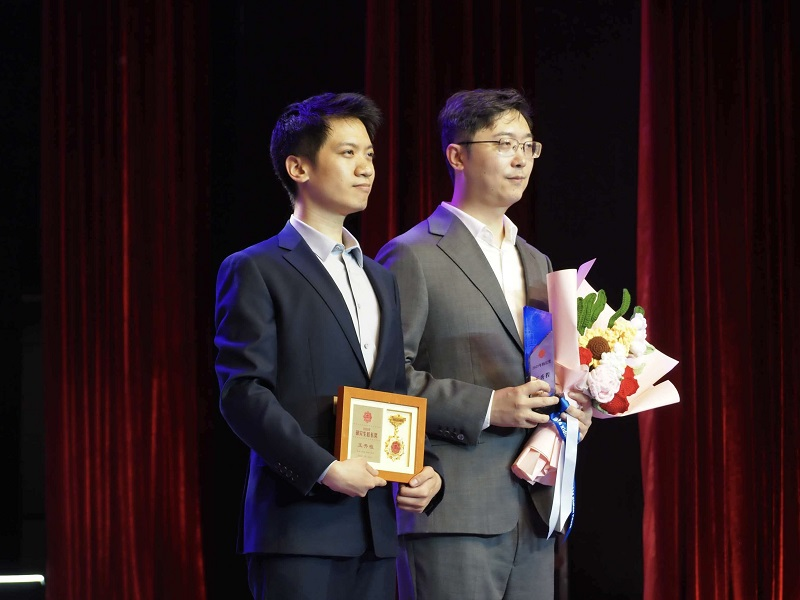

热烈祝贺UNIC实验室王秀程同学荣获西安电子科技大学研究生校长奖

<!--more-->

    </img>

在西安电子科技大学 “星火相传 荣光共耀” 2025-2026 年度五四表彰大会上，UNIC 实验室王秀程同学被授予研究生校长奖，由校党委书记任小龙为其颁奖，承楠教授作为导师共同见证了这一荣耀时刻。星火相传，青春接力。这份荣誉不仅是对王秀程同学个人努力的肯定，更是 UNIC 实验室育人成果的生动体现。在承楠教授的带领下，实验室始终坚持 “立德树人、科研报国” 的理念，为青年学子搭建成长平台，鼓励大家勇攀科技高峰、服务国家需求。
