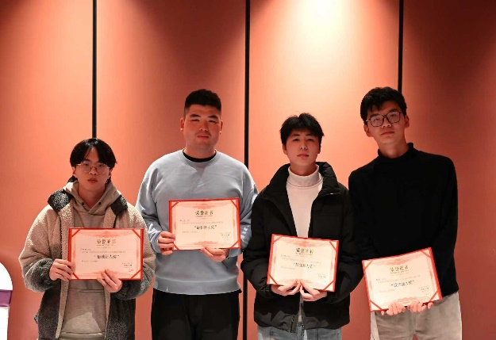
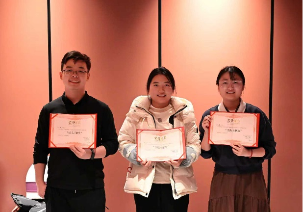
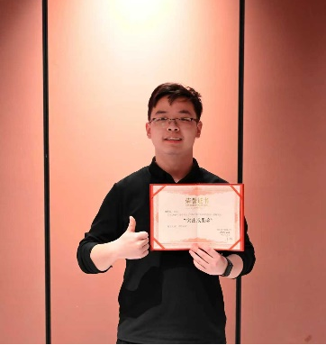
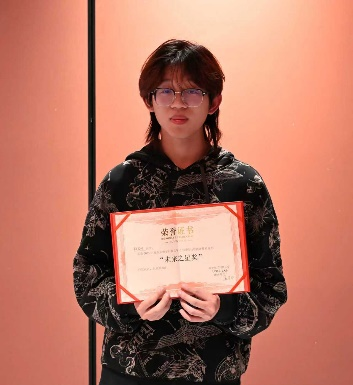
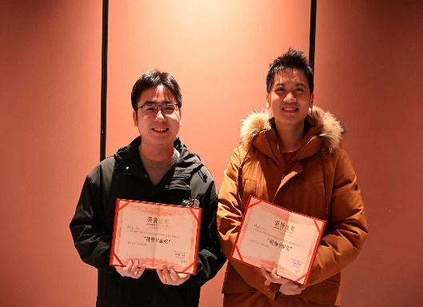
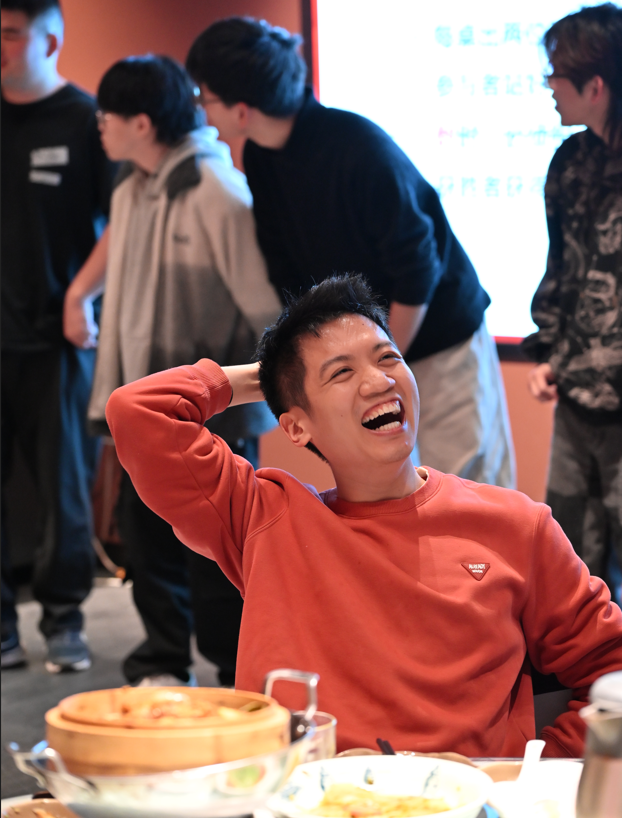
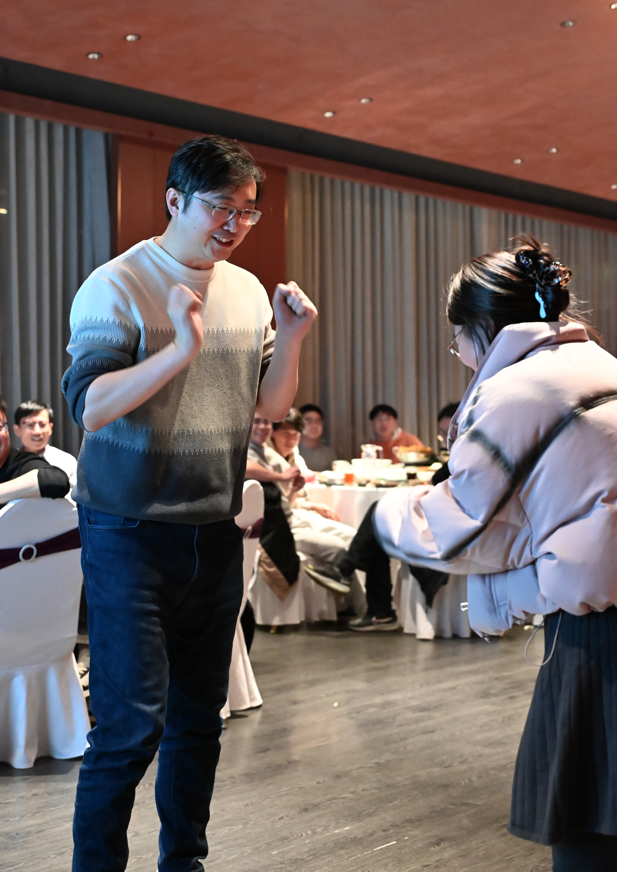
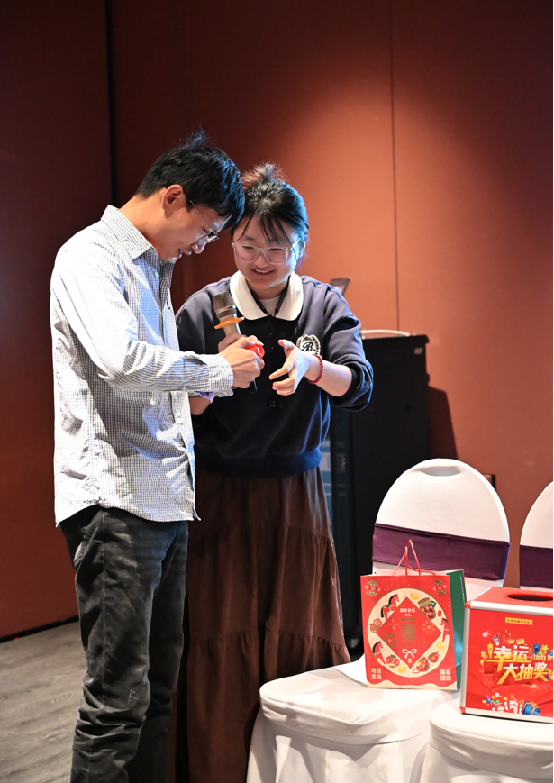

UNIC实验室全体师生齐聚举办2026年总结表彰年会活动

<!--more-->

2026年2月3日晚，我实验室成功举办了UNIC 2026年会盛典。本次年会旨在总结2025年度科研工作成效，表彰先进典范、共绘未来蓝图。本次年会设置颁奖环节、幸运大抽奖、互动游戏三大核心板块，在表彰优秀同学的同时，为年会现场注入了欢乐与温情。

年会开始，承楠教授首先回顾了过去一年的科研进展与团队建设成果，对同学们在科研探索中的主动思考、协作精神给予充分肯定，并鼓励大家在新的一年里继续深耕领域、勇攀高峰。

颁奖环节中，共设置五类奖项。杨双宇、张岳、郑佩林、万佳林 4 位同学凭借在电磁地图优化、星地电磁地图构建、电磁材质反演、大模型通信等方向的扎实探索，荣获 “最佳新人奖”；王兆薇、邱子仪、方忠盛在实验室管理、华为合作项目推进、青年科学家项目平台搭建中默默付出，获评 “团队贡献奖”；沈京龙以实验室第一篇 AI 顶会论文的突出成果，摘得 “突出成果奖”；张启明、黄浚淅深度参与系列核心工作，在预训练模型整理、电磁态势数据生成等方面表现亮眼，荣获 “未来之星奖”；贾宏刚主动探索低空电磁地图构建，快速搭建孪生平台获合作方高度认可，王秀程在电磁地图领域取得全球引领性成果并积极组织科研活动，二人共同斩获 “特殊贡献奖”。老师们为获奖者颁发荣誉证书，现场掌声不断，既是对获奖者的肯定，更是对全体人员实干笃行的激励。

幸运大抽奖环节惊喜不断，丰厚奖品承载着实验室对师生的关怀。每一份幸运都让现场欢呼声不断，为年会增添了满满喜悦。互动游戏环节趣味盎然，“逢七必过”“反应堆叠”“数字炸弹”等七大游戏轮番上演。师生们踊跃参与，在紧张刺激的比拼中放下科研压力，展现出风趣活泼的一面。失误时的爆笑、获胜时的欢呼交织在一起，不仅增进了师生间、同窗间的情谊，更凝聚了实验室的向心力。

此次年会既是对过去一年科研与团队建设的总结，更是新一年砥砺前行的动员令。未来，UNIC 实验室的师生们将继续携手并肩，在科研道路上策马扬鞭、勇毅探索，共同书写更多科研佳绩。
