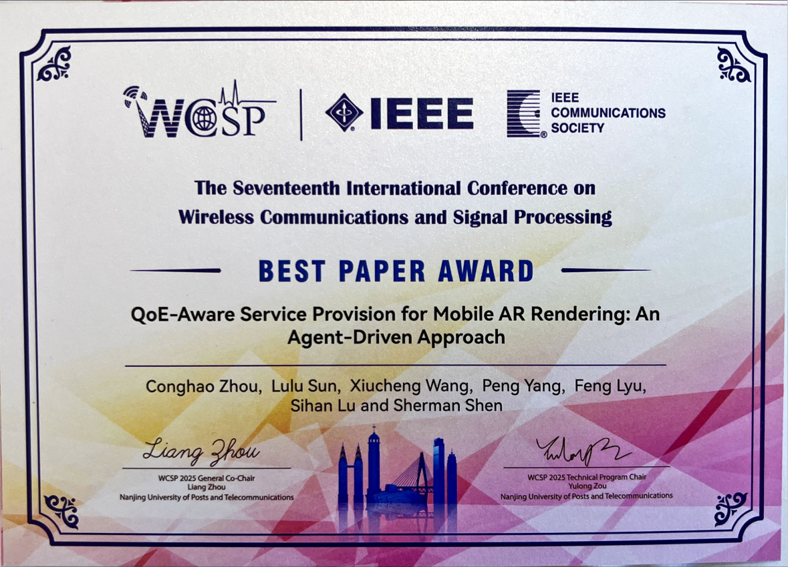

UNIC实验室孙路路同学、周淙浩老师参加WCSP国际会议并荣获最佳论文奖

<!--more-->

UNIC实验室孙路路等同学，参与了2025年第十七届国际无线通信与信号处理会议（WCSP）的论文评选。其论文《QoE-Aware Service Provision for Mobile AR Rendering: An Agent-Driven Approach》聚焦移动增强现实（AR）渲染的服务质量感知问题，提出智能体驱动的创新方案。经过多轮学术评审，团队在众多投稿中表现突出，荣获本次会议最佳论文奖。

</img>
