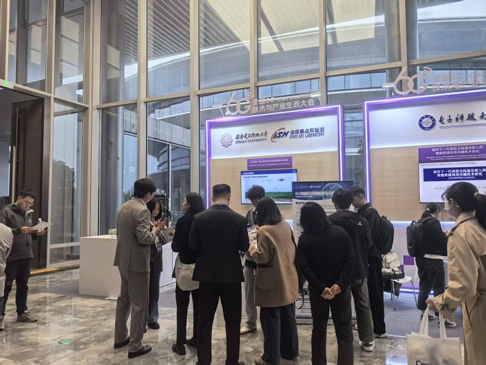

祝贺承楠教授荣获2026全球6G技术与产业生态大会“6G星辰青年科学家”

<!--more-->

    </img>

4月21日至23日，承楠教授参加由未来移动通信论坛、紫金山实验室主办的2026全球6G技术与产业生态大会。大会上，承楠教授代表西安电子科技大学空天地一体化综合业务网全国重点实验室，在面向6G网络智能化与电磁空间智能孪生方向，集中展示了最新研究成果。其中，由实验室UNIC研发的“AgentRay：大模型驱动的电磁空间智能孪生认知基座平台”亮相大会展区。该平台面向复杂无线环境下的电磁空间感知、建模、推演与智能决策需求，融合大模型、射线追踪、数字孪生与网络智能优化等技术，构建面向6G场景的电磁空间智能认知与仿真验证基础能力。

经大会程序委员会专家严格评审，实验室承楠老师获评2026届“6G星辰青年科学家”荣誉称号，并在大会期间获颁荣誉证书。此次获评体现了大会及同行专家对实验室UNIC相关研究工作的认可。
