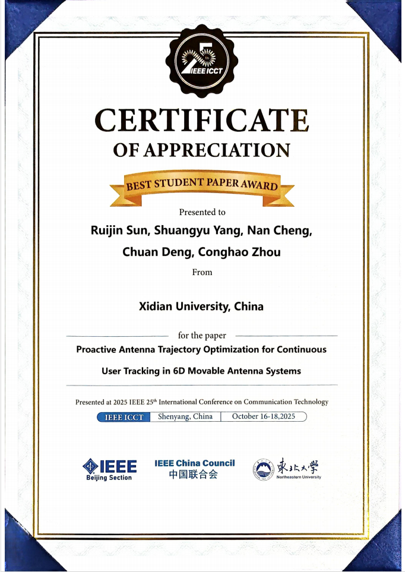

祝贺UNIC实验室杨双宇同学，孙瑞锦老师在2025年第二十五届ICCT国际会议荣获最佳论文奖

<!--more-->

UNIC实验室杨双宇同学在2025年第二十五届ICCT国际会议的论文被接受。其论文《Proactive Antenna Trajectory Optimization for Continuous User Tracking in 6D Movable Antenna Systems》针对 6D 可移动天线传统优化方法的不足，开发主动式天线轨迹优化方法，通过联合优化天线位向、纳入多重约束，利用信道知识图和离散贪心搜索求解，生成的轨迹频谱效率高于基准方法。

</img>
